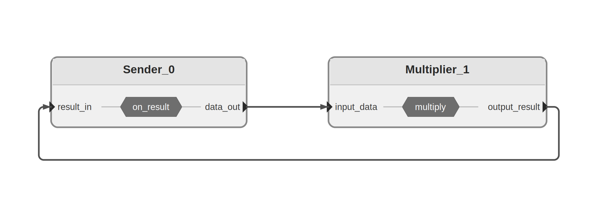
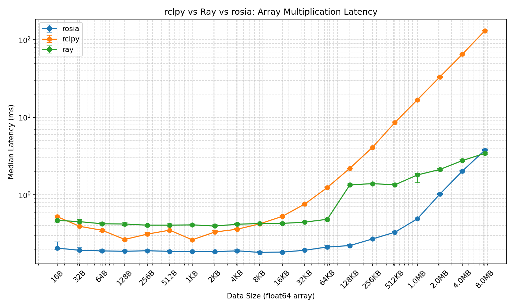

# Latency Benchmark

## Setup

This benchmark measures **round-trip latency** of array multiplication across three frameworks: Rosia, ROS 2 (rclpy), and Ray.

### Task

A sender node sends a `float64` numpy array and a scalar multiplier to a multiplier node, which multiplies the array element-wise and sends the result back. The latency is measured as the time from sending the array to receiving the result.

### Pipeline



```
Sender ──(array, scalar)──► Multiplier ──(result)──► Sender
```

- **Rosia**: Two nodes connected via input/output ports in a feedback loop.
- **ROS 2**: Two nodes communicating via pub/sub topics (`array_data` and `array_result`).
- **Ray**: A remote actor with a `multiply()` method called via `ray.get()`.

### Environment

- **Machine**: MacBook Pro with Apple M4 Pro chip
- **Container**: Docker (ARM64), based on `ros:humble`

### Parameters

- **Array sizes**: 2 to 1,048,576 elements (`2^1` to `2^20`), corresponding to 16 bytes to 8 MB of `float64` data.
- **Warmup**: 20 iterations per array size (discarded).
- **Measured iterations**: 20 per array size.
- **Metric**: Median latency in milliseconds.

The `% faster` column shows how much less time Rosia takes compared to ROS 2, calculated as `(ROS2_median - Rosia_median) / ROS2_median * 100`. For example, if ROS 2 takes 10ms and Rosia takes 2ms, the result is +80%, meaning Rosia
completes the same task in 80% less time.

## Results

On average, Rosia is **67.1%** faster than ROS 2.



|    Size |   Rosia |     ROS 2 |     Ray | % faster |
| ------: | ------: | --------: | ------: | -------: |
|       2 | 0.205ms |   0.523ms | 0.469ms |   +60.8% |
|       4 | 0.193ms |   0.393ms | 0.450ms |   +51.0% |
|       8 | 0.189ms |   0.349ms | 0.423ms |   +45.8% |
|      16 | 0.187ms |   0.266ms | 0.420ms |   +29.8% |
|      32 | 0.190ms |   0.311ms | 0.406ms |   +38.8% |
|      64 | 0.186ms |   0.350ms | 0.406ms |   +46.8% |
|     128 | 0.185ms |   0.263ms | 0.410ms |   +29.4% |
|     256 | 0.185ms |   0.331ms | 0.396ms |   +44.2% |
|     512 | 0.189ms |   0.360ms | 0.417ms |   +47.4% |
|    1024 | 0.181ms |   0.422ms | 0.427ms |   +57.2% |
|    2048 | 0.182ms |   0.527ms | 0.428ms |   +65.4% |
|    4096 | 0.193ms |   0.761ms | 0.444ms |   +74.7% |
|    8192 | 0.212ms |   1.244ms | 0.484ms |   +82.9% |
|   16384 | 0.221ms |   2.199ms | 1.343ms |   +89.9% |
|   32768 | 0.269ms |   4.084ms | 1.395ms |   +93.4% |
|   65536 | 0.329ms |   8.553ms | 1.347ms |   +96.2% |
|  131072 | 0.491ms |  16.840ms | 1.805ms |   +97.1% |
|  262144 | 1.023ms |  33.279ms | 2.125ms |   +96.9% |
|  524288 | 2.028ms |  65.225ms | 2.768ms |   +96.9% |
| 1048576 | 3.777ms | 131.417ms | 3.432ms |   +97.1% |
