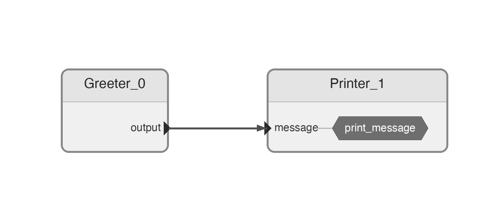

# Hello World

This tutorial builds a simple Rosia application: one node sends a message, another prints it.

## Define Nodes

A Rosia node is a Python class decorated with `@Node`. Ports are declared as class attributes.

```python
from rosia import InputPort, OutputPort, reaction, Node, Application
from rosia import log

@Node
class Greeter:
    output = OutputPort[str]()  # OutputPort[T]() declares a typed output port

    # start() is called once when the application begins
    def start(self):
        self.output("Hello, World!")  # Send a value on an output port

@Node
class Printer:
    # Do not use `input` as a port name since it's a reserved Python keyword
    message = InputPort[str]() # InputPort[T]() declares a typed input port

    @reaction([message])  # Fire when listed port receives a message
    def print_message(self):
        log.info(self.message)  # self.message reads the current value of the input port
        # log is Rosia's built-in logger. It prefixes messages with the node name
        # (e.g. [Printer_1]). Available levels: log.debug(), log.info(), log.warning(), log.error()
```

## Wire and Run

Create a `Application`, instantiate nodes, connect ports with `>>=`, and call `execute()`. Connections are automatically type checked.

```python
app = Application()
greeter = app.create_node(Greeter())
printer = app.create_node(Printer())
greeter.output >>= printer.message
app.diagram(save_to="hello_diagram.svg")
app.execute()
```

Optinally, `app.diagram(save_to="hello_diagram.svg")` generates an SVG visualization of the dataflow graph, showing nodes and their port connections:



Run with `python hello.py`. This produces:

```
[Printer_1] Hello, World!
```

## What happened

1. `Greeter.start()` sends `"Hello, World!"` on its output port.
2. `Printer` reacts to the message and logs it. Since greeter is numbered 0, printer is numbered 1.
3. Since `Greeter` has no more messages to send, it signals completion. `Printer` receives this signal, detects it has no more work, and the application shuts down automatically.
